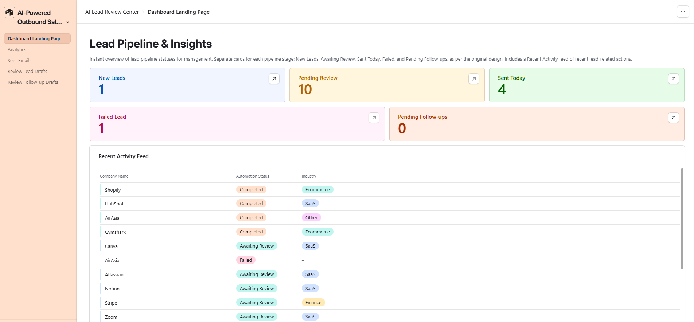
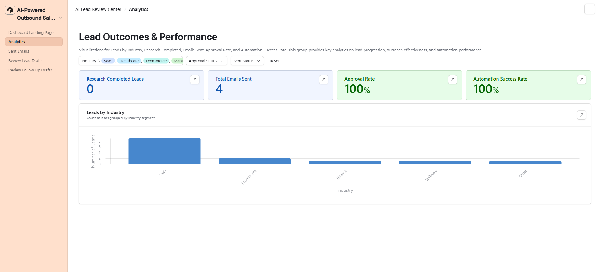
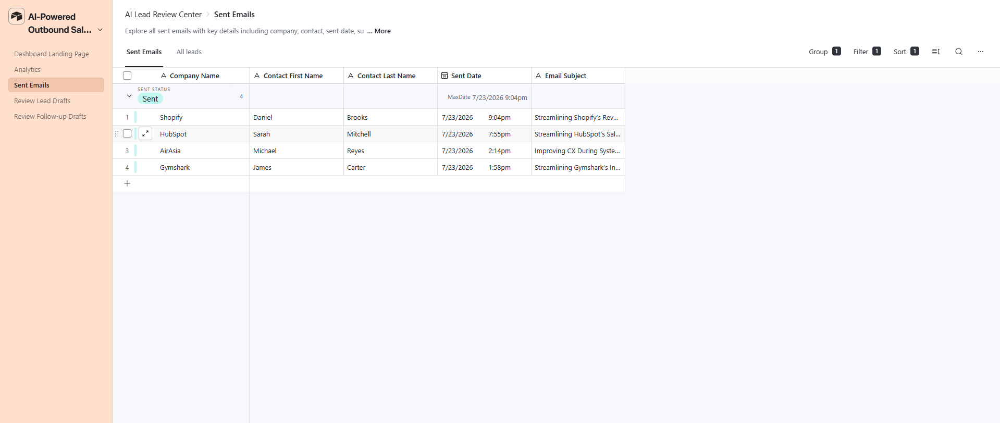

# Workflow Architecture

## Overview

This project automates outbound lead research, personalized email generation, approval, delivery, and follow-up management for an AI automation agency using **n8n** and **Airtable**.

Leads are submitted through an Airtable form and processed through eight modular workflows. The system validates each lead, retrieves company website content, generates structured company research with OpenAI, drafts personalized outreach, waits for human approval, sends approved emails through Gmail, and manages follow-up generation and delivery.

Instead of placing the entire process inside one large workflow, the solution follows a **modular workflow architecture**. Each workflow has one clearly defined responsibility and passes records to the next workflow using Airtable record IDs and n8n sub-workflow calls.

Human approval is required before both initial outreach emails and follow-up emails are sent.

---

## n8n Workflows

Add a screenshot of the complete workflow list or the individual workflow canvases here.

```text
01 - Lead Intake
02 - Company Research
03 - AI Outreach Generation
04 - Human Approval
05 - Email Sender
06 - Follow-up Generator
07 - Follow-up Approval
08 - Send Follow-up
```

---

# System Architecture

```text
                         Airtable Lead Form
                                │
                                ▼
                       ┌───────────────────┐
                       │    Leads Table    │
                       │ Status: New       │
                       └───────────────────┘
                                │
                                ▼
                       ┌───────────────────┐
                       │ 01 - Lead Intake  │
                       │ Validate Lead     │
                       └───────────────────┘
                                │
                                ▼
                  ┌────────────────────────────┐
                  │ 02 - Company Research      │
                  │ Jina Reader + OpenAI       │
                  └────────────────────────────┘
                                │
                                ▼
                  ┌────────────────────────────┐
                  │ 03 - AI Outreach           │
                  │ Generation                 │
                  └────────────────────────────┘
                                │
                                ▼
                       Airtable Draft Review
                                │
                                ▼
                  ┌────────────────────────────┐
                  │ 04 - Human Approval        │
                  └────────────────────────────┘
                                │
                                ▼
                  ┌────────────────────────────┐
                  │ 05 - Email Sender          │
                  │ Gmail Delivery             │
                  └────────────────────────────┘
                         │              │
                         │              ├───────────────┐
                         ▼              ▼               ▼
                  Outreach Table   Follow-ups Table  Automation Logs
                                        │
                                        ▼
                  ┌────────────────────────────┐
                  │ 06 - Follow-up Generator   │
                  │ OpenAI Draft Generation    │
                  └────────────────────────────┘
                                        │
                                        ▼
                              Airtable Draft Review
                                        │
                                        ▼
                  ┌────────────────────────────┐
                  │ 07 - Follow-up Approval    │
                  └────────────────────────────┘
                                        │
                                        ▼
                  ┌────────────────────────────┐
                  │ 08 - Send Follow-up        │
                  │ Gmail Delivery             │
                  └────────────────────────────┘
                         │              │
                         ▼              ▼
                  Outreach Table   Automation Logs
```

---

# Design Philosophy

This project follows a **modular, event-driven workflow architecture**.

Each n8n workflow is responsible for one stage of the outbound process. Airtable acts as the CRM, approval interface, persistent queue, and source of truth, while n8n handles orchestration, AI processing, validation, and external integrations.

This architecture provides several advantages:

- Separation of responsibilities
- Easier workflow maintenance
- Improved debugging and testing
- Reusable research, drafting, and sending workflows
- Human control over external communication
- Clear workflow status tracking
- Reduced risk of duplicate processing
- Easier replacement of individual components
- Better scalability than one large workflow

---

# Workflow Responsibilities

## 01 - Lead Intake

### Purpose

Receives new Airtable leads, validates the required company information, and routes valid records to the Company Research workflow.

### Trigger

A Schedule Trigger runs every minute and searches the Leads table for records where:

```text
Automation Status = New
```

### Responsibilities

- Search Airtable for new lead records
- Validate the company name and company website
- Mark valid records as `Processing`
- Mark incomplete records as `Failed`
- Create an Automation Logs record
- Pass the Airtable record ID to Company Research
- Process multiple leads as separate workflow items

### Workflow

```text
Schedule Trigger
        │
        ▼
Search New Lead Records
        │
        ▼
Validate Required Fields
       / \
      /   \
 Valid   Invalid
   │        │
   ▼        ▼
Processing Failed
   │
   ├──────────────► Automation Log
   │
   ▼
Call Company Research
```

---

## 02 - Company Research

### Purpose

Retrieves the full Airtable lead record, extracts readable company website content, and generates structured company research.

### Responsibilities

- Receive the Airtable lead record ID
- Retrieve the complete lead record
- Build a Jina AI Reader URL
- Fetch website content as clean text
- Send company data and website content to OpenAI
- Enforce structured AI output
- Update the Airtable lead record
- Create an Automation Logs record
- Call AI Outreach Generation

### Workflow

```text
Sub-workflow Trigger
        │
        ▼
Get Lead Record
        │
        ▼
Prepare Research Input
        │
        ▼
Jina AI Reader
        │
        ▼
OpenAI Research Chain
        │
        ▼
Structured Output Parser
        │
        ▼
Update Airtable Lead
        │
        ├──────────────► Automation Log
        │
        ▼
Call AI Outreach Generation
```

### AI Output

The research workflow returns:

- Industry
- Research summary
- Likely pain points
- Personalization angle
- Automation opportunities

### Industry Classification

The AI must choose one industry from the Airtable-compatible list:

```text
SaaS
Software
Ecommerce
Retail
Healthcare
Finance
Manufacturing
Other
```

### Research Prompt

```text
You are a careful B2B company research analyst.

Analyze the company using only the company information and website content provided.

Produce:

1. The company's primary industry.
2. A factual research summary in 2 to 4 sentences.
3. Three likely business pain points relevant to the contact's role.
4. One specific personalization angle for a cold outreach email.
5. Three practical AI or workflow automation opportunities.

Do not invent unsupported company facts.
Choose the primary industry only from the approved Airtable industry list.
```

---

## 03 - AI Outreach Generation

### Purpose

Generates a personalized initial outreach email using the lead profile and AI-generated company research.

### Responsibilities

- Receive the enriched lead record ID
- Retrieve the complete Airtable lead
- Generate a personalized email subject
- Generate a concise outreach email
- Parse the response into structured fields
- Store the draft in Airtable
- Set the lead to `Awaiting Review`
- Set Approval Status to `Pending Review`
- Create an Automation Logs record

### Workflow

```text
Sub-workflow Trigger
        │
        ▼
Get Enriched Lead
        │
        ▼
OpenAI Outreach Chain
        │
        ▼
Structured Output Parser
        │
        ▼
Update Email Subject and Draft
        │
        ▼
Set Awaiting Review
        │
        ▼
Automation Log
```

### AI Output

```json
{
  "email_subject": "string",
  "email_draft": "string"
}
```

### Outreach Prompt

```text
You are a B2B outreach copywriter.

Write a concise, personalized cold email using the contact's role,
company, industry, research summary, pain points, and personalization angle.

The email should:

- Open with a specific observation
- Connect one relevant pain point to an automation opportunity
- Avoid exaggerated claims
- Use a professional but conversational tone
- Be between 90 and 140 words
- End with a low-pressure call to action
- Avoid mentioning that AI researched the company
- Avoid inventing unsupported facts

Generate a subject line of no more than seven words.
```

---

## 04 - Human Approval

### Purpose

Acts as the human approval gate for initial outreach emails.

The workflow does not generate or send content. It waits for a reviewer to inspect or edit the Airtable email draft and change the approval status to `Approved`.

### Trigger

A Schedule Trigger runs every minute and searches for records matching:

```text
Approval Status = Approved
AND Sent Status = Not Sent
AND Automation Status = Awaiting Review
```

### Responsibilities

- Detect manually approved outreach drafts
- Confirm the email has not already been sent
- Change Automation Status to `Sending`
- Create an approval log
- Call the Email Sender workflow

### Workflow

```text
Schedule Trigger
        │
        ▼
Search Approved Leads
        │
        ▼
Set Status to Sending
        │
        ├──────────────► Automation Log
        │
        ▼
Call Email Sender
```

---

## 05 - Email Sender

### Purpose

Performs final validation and sends the approved initial outreach email through Gmail.

### Responsibilities

- Receive the approved lead
- Validate the approval status
- Confirm the email has not already been sent
- Confirm recipient, subject, and body are present
- Send the email through Gmail
- Update the lead as completed
- Record the sent date
- Schedule the next follow-up
- Create an Outreach record
- Create a Follow-up record
- Log success or failure

### Validation Rules

The email is sent only when:

```text
Approval Status = Approved
Sent Status = Not Sent
Email Address is not empty
Email Subject is not empty
Email Draft is not empty
```

### Workflow

```text
Sub-workflow Trigger
        │
        ▼
Retrieve Approved Lead
        │
        ▼
Final Validation
       / \
      /   \
 Valid   Invalid
   │        │
   ▼        ▼
Gmail     Set Failed
   │        │
   │        ▼
   │    Failure Log
   ▼
Update Lead as Sent
   │
   ├──────────────► Outreach Record
   ├──────────────► Follow-up Record
   └──────────────► Success Log
```

### Lead Updates

After successful delivery:

```text
Sent Status = Sent
Automation Status = Completed
Sent Date = Current Date and Time
Next Follow-Up = Current Date and Time + 3 Days
```

---

## 06 - Follow-up Generator

### Purpose

Finds scheduled follow-ups that have reached their due date and generates a concise AI follow-up draft.

### Responsibilities

- Search the Follow-ups table for due records
- Retrieve the related lead
- Use the original outreach and company research as context
- Generate a follow-up subject and body
- Parse the response into structured fields
- Save the draft in Airtable
- Set the follow-up to `Awaiting Review`

### Workflow

```text
Schedule Trigger
        │
        ▼
Search Due Follow-ups
        │
        ▼
Get Related Lead
        │
        ▼
OpenAI Follow-up Chain
        │
        ▼
Structured Output Parser
        │
        ▼
Update Follow-up Draft
        │
        ▼
Set Awaiting Review
```

### AI Output

```json
{
  "follow_up_subject": "string",
  "follow_up_draft": "string"
}
```

### Follow-up Prompt

```text
You are a B2B outreach copywriter for an AI automation agency.

Write a concise follow-up email based on the original outreach and lead information.

The follow-up should:

- Naturally reference the previous email
- Avoid repeating the original pitch
- Add one useful idea or automation opportunity
- Be professional and conversational
- Be no more than 80 words
- Use a low-pressure call to action
- Never claim that the recipient opened or read the email
- Never invent unsupported facts

Generate a subject line of no more than seven words.
```

---

## 07 - Follow-up Approval

### Purpose

Acts as the human approval gate for AI-generated follow-up emails.

A reviewer checks the subject and draft in Airtable and changes the follow-up status to `Approved`.

### Trigger

A Schedule Trigger runs every minute and searches the Follow-ups table for:

```text
Status = Approved
```

### Responsibilities

- Detect approved follow-up drafts
- Create an approval log
- Pass the approved follow-up to Send Follow-up

### Workflow

```text
Schedule Trigger
        │
        ▼
Search Approved Follow-ups
        │
        ├──────────────► Automation Log
        │
        ▼
Call Send Follow-up
```

---

## 08 - Send Follow-up

### Purpose

Performs final validation and sends an approved follow-up through Gmail.

### Responsibilities

- Receive the approved follow-up record
- Validate the approval status
- Confirm recipient, subject, and draft are present
- Send the follow-up through Gmail
- Update the Follow-up record to `Sent`
- Record the sent date
- Add the communication to the Outreach table
- Create an Automation Logs record

### Validation Rules

The follow-up is sent only when:

```text
Status = Approved
Email Address is not empty
Subject is not empty
Draft is not empty
```

### Workflow

```text
Sub-workflow Trigger
        │
        ▼
Validate Follow-up
       / \
      /   \
 Valid   Invalid
   │        │
   ▼        ▼
Gmail     Stop
   │
   ├──────────────► Update Follow-up as Sent
   ├──────────────► Outreach Record
   └──────────────► Automation Log
```

---

# Airtable Architecture

The Airtable base acts as the CRM, approval interface, operational database, and workflow state store.

## Leads Table

### Purpose

Stores the original lead data, AI research, outreach draft, approval state, and delivery state.

### Main Fields

```text
Lead ID
Lead Name
Company Name
Company Website
Contact First Name
Contact Last Name
Job Title
Email Address
LinkedIn URL
Industry
Company Location
Automation Status
Research Summary
Pain Points
Personalization Angle
Email Subject
Email Draft
Approval Status
Sent Status
Sent Date
Next Follow-Up
```

---

## Outreach Table

### Purpose

Maintains a communication history of all initial emails and follow-ups sent by the system.

### Fields

```text
Outreach ID
Related Lead
Outreach Type
Email Subject
Email Body
Status
Created Date
Scheduled Send Date
Sent Date
Recipient Email
Reply Status
```

---

## Follow-ups Table

### Purpose

Stores scheduled follow-up tasks, AI-generated drafts, approval state, and delivery history.

### Fields

```text
Follow-up ID
Related Lead
Follow-Up Number
Due Date
Subject
Draft
Status
Sent Date
Created at
```

---

## Automation Logs Table

### Purpose

Provides an audit trail of workflow activity linked to the related lead.

### Fields

```text
Timestamp
Workflow
Relate Lead
Status
Message
```

---
## Airtable Interface

### Purpose

The Airtable Interface provides a user-friendly operational layer on top of the underlying CRM tables.

Instead of requiring users to work directly inside the raw Airtable base, the interface gives sales and operations users dedicated pages for monitoring the pipeline, reviewing AI-generated drafts, checking sent emails, and viewing performance metrics.

The interface is named:

```text
AI Lead Review Center
```

### Interface Pages

```text
Dashboard Landing Page
Analytics
Sent Emails
Review Lead Drafts
Review Follow-up Drafts
```

---

### Dashboard Landing Page

The Dashboard Landing Page gives management an immediate view of the current pipeline.

It includes KPI cards for:

- New Leads
- Drafting
- Pending Review
- Sent Today
- Failed Leads
- Pending Follow-ups

It also includes a Recent Activity Feed showing:

- Company Name
- Automation Status
- Industry



The dashboard allows users to quickly identify records that need attention without opening the underlying Leads table.

---

### Analytics

The Analytics page provides a summarized view of lead outcomes and automation performance.

It includes filters for:

```text
Industry
Approval Status
Sent Status
```

The page includes KPI cards for:

- Research Completed Leads
- Total Emails Sent
- Approval Rate
- Automation Success Rate

It also includes a Leads by Industry chart to show how the pipeline is distributed across business segments.



This page gives stakeholders a high-level view of outreach volume, approval activity, and workflow reliability.

---

### Sent Emails

The Sent Emails page provides a searchable record of successfully delivered outreach.

It displays:

- Company Name
- Contact First Name
- Contact Last Name
- Sent Date
- Email Subject
- Sent Status



This page acts as a simplified communication history for users who do not need direct access to the full Outreach table.

---

### Review Lead Drafts

The Review Lead Drafts page is the human approval workspace for initial outreach.

Reviewers can inspect and edit:

- Company and contact information
- Research Summary
- Pain Points
- Personalization Angle
- Email Subject
- Email Draft
- Approval Status

The Human Approval workflow only processes a lead after the reviewer changes its Approval Status to:

```text
Approved
```

This page creates a clear separation between AI content generation and external email delivery.

---

### Review Follow-up Drafts

The Review Follow-up Drafts page is the human approval workspace for follow-up messages.

Reviewers can inspect and edit:

- Related Lead
- Follow-Up Number
- Due Date
- Subject
- Draft
- Status

The Follow-up Approval workflow only sends records whose status has been manually changed to:

```text
Approved
```

This provides a second human-in-the-loop control point before any follow-up is delivered.

---

### Interface Role in the Architecture

```text
                    Airtable Data Tables
                            │
                            ▼
                 ┌──────────────────────┐
                 │  Airtable Interface │
                 │ AI Lead Review      │
                 │ Center              │
                 └──────────────────────┘
                    │       │       │
                    │       │       │
                    ▼       ▼       ▼
              Monitoring  Approval  Analytics
                    │       │       │
                    └───────┴───────┘
                            │
                            ▼
                       n8n Workflows
```

The Airtable Interface is not a separate automation engine. It is the user-facing control center for the n8n workflows and Airtable data model.

It supports three main functions:

| Function | Interface Role |
|---|---|
| Monitoring | Displays pipeline status, failures, sent emails, and pending work |
| Human Approval | Allows reviewers to edit and approve initial and follow-up drafts |
| Analytics | Summarizes email volume, approval rates, industries, and automation performance |

---


# Data Relationships

```text
┌─────────────────────┐
│        Leads        │
└─────────────────────┘
       │       │
       │       ├─────────────────────────┐
       │                                 │
       ▼                                 ▼
┌─────────────────────┐          ┌─────────────────────┐
│      Outreach       │          │     Follow-ups      │
│ Related Lead        │          │ Related Lead        │
└─────────────────────┘          └─────────────────────┘
       │
       │
       ▼
Communication History

┌─────────────────────┐
│  Automation Logs    │
│ Relate Lead         │
└─────────────────────┘
       ▲
       │
       └──────── Linked to Leads
```

A single lead can have:

- Multiple Outreach records
- Multiple Follow-up records
- Multiple Automation Log records

---

# Workflow State Management

Airtable status fields act as a persistent workflow queue.

## Lead Status Flow

```text
New
 │
 ▼
Processing
 │
 ▼
Drafting
 │
 ▼
Awaiting Review
 │
 ▼
Sending
 │
 ▼
Completed
```

Failure path:

```text
New / Processing / Sending
             │
             ▼
           Failed
```

Supporting states:

```text
Approval Status:
Pending Review → Approved or Rejected

Sent Status:
Not Sent → Sent
```

## Follow-up Status Flow

```text
Scheduled
    │
    ▼
Awaiting Review
    │
    ▼
Approved
    │
    ▼
Sent
```

---

# Human-in-the-Loop Design

The project includes two separate human approval stages.

## Initial Outreach Approval

The AI generates a subject and email draft but cannot send it.

A human reviewer can:

- Inspect the research
- Edit the subject
- Edit the email body
- Approve or reject the draft

Only approved records are passed to the Email Sender workflow.

## Follow-up Approval

The AI generates the follow-up subject and body but cannot send it.

A human reviewer must change the Follow-up status to `Approved` before the Send Follow-up workflow can execute.

This approach provides:

- Brand and tone control
- Protection from unsuitable AI content
- An opportunity to correct inaccurate details
- A clear approval audit trail
- Safer use of AI in external communication

---

# Design Decisions

| Decision | Benefit |
|---|---|
| Separate workflows for each stage | Easier debugging and independent testing |
| Airtable as persistent state storage | Records remain available if n8n is temporarily unavailable |
| Scheduled polling | Unprocessed records can be recovered during the next execution |
| Airtable record IDs between workflows | Reliable record identification |
| Structured Output Parsers | Predictable AI responses for field mapping |
| Human approval before sending | Prevents uncontrolled AI communication |
| Final validation in sender workflows | Stops incomplete or stale records from being sent |
| Outreach history table | Provides a complete record of external communication |
| Automation Logs table | Improves traceability and troubleshooting |
| Status changes before sending | Reduces duplicate email risk |

---

# Error Handling and Duplicate Prevention

The workflows use layered validation and status changes to reduce invalid or duplicate processing.

### Lead Intake

Incomplete leads are marked as `Failed` before AI tokens are used.

### Initial Email Sender

The sender checks:

- Approval Status
- Sent Status
- Recipient Email
- Email Subject
- Email Draft

The lead is changed to `Sending` before delivery and `Completed` afterward.

### Follow-up Sender

The sender checks:

- Follow-up Status
- Recipient Email
- Subject
- Draft

After delivery, the Follow-up is changed to `Sent`.

### Logging

Automation Logs record workflow success and failure events and link them to the related lead.

---

# Security

Credentials are managed through n8n credentials rather than being entered directly inside workflow logic.

Required credentials include:

- Airtable Personal Access Token
- OpenAI API credential
- Gmail OAuth2 credential

Recommended security practices:

- Do not commit API keys or OAuth secrets to GitHub
- Use least-privilege Airtable token scopes
- Restrict Gmail access to the intended sender account
- Remove test credentials before sharing workflow exports
- Store environment-specific values in n8n variables or credentials

---

# Repository Structure

```text
ai-lead-generation-platform/
│
├── README.md
├── ARCHITECTURE.md
│
├── workflows/
│   ├── 01 - Lead Intake.json
│   ├── 02 - Company Research.json
│   ├── 03 - AI Outreach Generation.json
│   ├── 04 - Human Approval.json
│   ├── 05 - Email Sender.json
│   ├── 06 - Follow-up Generator.json
│   ├── 07 - Follow-up Approval.json
│   └── 08 - Send Follow-up.json
│
├── docs/
│   ├── screenshots/
│   ├── airtable-schema.md
│   └── setup-guide.md
│
└── assets/
    ├── architecture-diagram.png
    ├── airtable-interface-dashboard.png
    ├── airtable-interface-analytics.png
    └── airtable-interface-sent-emails.png
```

---

# Future Improvements

Potential enhancements include:

- Lead enrichment using Hunter, Apollo, or similar services
- Email address verification
- Duplicate lead detection
- Configurable follow-up delays
- Multiple follow-up stages
- Reply detection
- Automatic cancellation of follow-ups after a reply
- Airtable Interface dashboard
- Lead scoring
- Slack or Microsoft Teams approval notifications
- Central Settings table for prompts, delays, models, and signatures
- Retry queue for failed workflows
- Analytics for reply rate, conversion rate, and approval time
- Prompt versioning and A/B testing
- Calendar booking integration
